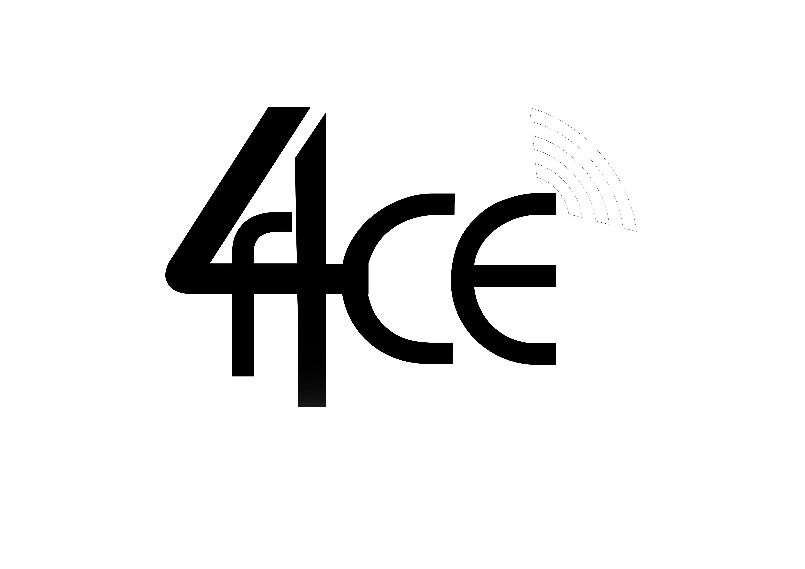

##Project F4CE :

<object data="http://i62.tinypic.com/258v8mt.gif" alt="F4CE logo" height=30% width=30%>
 </img>
</object>

----------------------------------------------------------------------------------------
##Contibutors :

### 	Ajith K S
### 	Nitin R
### 	Ananth K
### 	Manigandan G

----------------------------------------------------------------------------------------

##The F4CE project :

#### A cloud based graphics interface based on the idea that F4CE could be used to interface graphics application on low compatibility devices. Scriped in python and built on the Kivy framework.

----------------------------------------------------------------------------------------
 
